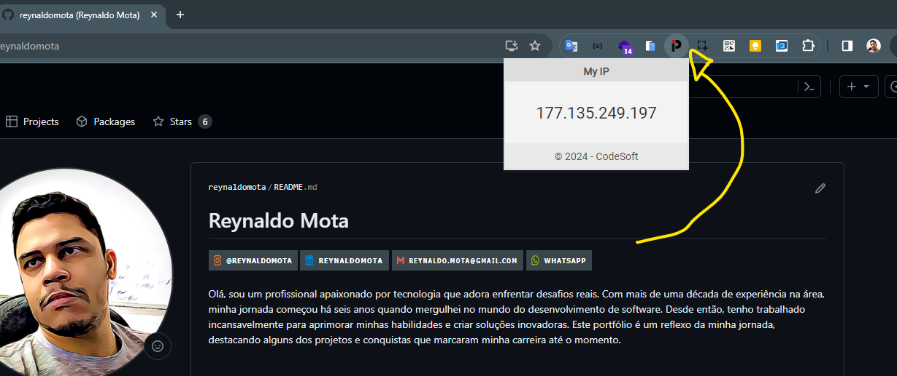

# My IP - Chrome Extension

## Descrição
A extensão My IP exibe o endereço IP da internet de forma rápida e fácil, facilitando o trabalho dos profissionais de TI.

## Instalação
Você pode instalar a extensão diretamente da Chrome Web Store. [Clique aqui para instalar](https://chromewebstore.google.com/detail/my-ip/jdlhfdnfjnjgfjjeoibmohnimlipmiop?pli=1).

## Como Usar
Depois de instalar a extensão, um ícone será adicionado à barra de ferramentas do Chrome. Clique no ícone para exibir o seu endereço IP da internet.

## Contribuindo
Este projeto é de código aberto e as contribuições são bem-vindas. Sinta-se à vontade para fazer um fork do repositório e enviar um pull request com melhorias.

## Licença
Este projeto é licenciado sob a [MIT License](LICENSE).
